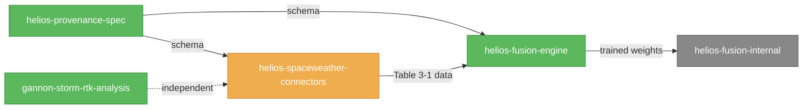

# HELIOS Artifact Buildout — Program Master Plan

## Context

577 Industries' NASA SBIR Phase I proposal "HELIOS: Heliophysics-Enhanced Location Integrity and Operations System" (`/home/twawe/577i-Projects/SBIR Working Folder/NASA/HELIOS_NASA_SBIR_PhaseI_Proposal.docx`) is submitted. The proposal advances a five-objective work plan around a model-agnostic Bayesian-Model-Averaging fusion engine for space-weather model outputs, with two vertical slices: NASA SRAG mission-operations radiation risk and U.S. precision-agriculture GNSS.

The goal of this plan is to convert four of the proposal's strongest claims from paper into citable, deployable, public artifacts:

1. **`helios-spaceweather-connectors`** — Python package + GitHub (Objective 1)
2. **`helios-fusion-engine`** (public framework) + private companion + arXiv preprint (Objective 2 + §3.1 pre-registration)
3. **`gannon-storm-rtk-analysis`** — repo + blog post (§1.3 marquee event + Objective 4 feasibility)
4. **`helios-provenance-spec`** — JSON Schema RFC + reference implementation (§1.4 CONOPS + §4.2 innovation #2)

Each artifact converts a paper claim into a URL reviewers and stakeholders can kick the tires on. They feed a **proposal companion document** maintained in parallel — a public-facing mirror of the submitted proposal with live citations — which becomes Phase II re-pitch material, NASA-center engagement collateral (CCMC, M2M SWAO, SRAG, SPoRT), and the 577industries.com/helios landing page.

Submission has happened; timeline is open-ended. The plan optimizes for **quality and Phase II readiness**, not deadline pressure.

## Decisions Locked

| Decision | Choice | Why it matters |
|---|---|---|
| Timeline | Open-ended, Phase II-oriented | Permits sequential quality gates over parallel speed-runs where the dependency requires it |
| Fusion-engine IP scope | **Hybrid**: public framework, private weights/configs | Matches §6.6 IP strategy; companion private repo `helios-fusion-internal` holds trained weights, BMA priors, equipment transfer functions |
| Execution team | Solo founder (Thomas) + heavy Claude agent delegation | Aggressive parallel agent dispatch across 4 worktrees; you on review/merge/secrets |
| Paper kill-gate | **§2 Obj. 3 criterion (pre-registered)**: fused all-clear-revocation HSS beats best-component-model HSS by ≥15% on 3-event hold-out (2022-01-20 M5.5, 2023-02-17 X2.2, 2024-05-11 Gannon G5) AND reliability slope within 0.15 across all Kp severity strata | Both must pass → full arXiv paper. One fails → honest-negative-result ablation paper (still valuable). Both fail → no paper, fusion engine ships without preprint citation |
| GitHub home | `github.com/577Industries/` (organization, alongside aegisgraph + model-router + agent-memory + tool-guardrails) | Matches established public 577 SBIR portfolio. Session-1 bootstrap mistakenly used the user account `577-Industries` (with hyphen); session-1 cleanup transferred all six repos to the org. See `CLAUDE.md` §"GitHub identity disambiguation" — non-negotiable for future sessions. |
| License | Apache 2.0 across all public repos | Preserves patent grant for SBIR data-rights compatibility; broader than MIT for SaaS/OEM downstreams |
| Python baseline | 3.11+ (3.12 preferred) | Pattern matching, exception groups, modern typing |

## Defaults applied (flag any to revise)

- **Local checkout convention**: `~/577i-Projects/<repo>/` matching existing sibling repos (`agent-memory`, `hashchain-audit`, `model-router`, `tool-guardrails`, `workflow-dag`).
- **Worktree convention**: `~/577i-Projects/.worktrees/<repo>-<branch>/` matching the directory you already maintain at `~/577i-Projects/.worktrees/`.
- **Meta-repo**: `~/577i-Projects/helios-program/` (private, on GitHub) holds the proposal companion document source, cross-repo orchestration scripts, the master plan tracker, kill-gate evaluation runner, and per-artifact design specs as they're created.
- **CITATION**: every public repo ships `CITATION.cff` so academic citers don't have to invent one.
- **PyPI**: `helios-spaceweather-connectors`, `helios-fusion-engine`, `helios-provenance` namespace; `helios-fusion-internal` is wheel-only via internal index, never PyPI.
- **DOI**: each public release tagged on GitHub auto-mints a Zenodo DOI (free, accepts arbitrary GitHub repos).

## Scope and Decomposition

The work splits into **one program-level orchestration layer** (this plan, plus the meta-repo `helios-program`) and **five independent execution streams**:

| Stream | Artifact | Public? | Eff. weeks | Critical-path? |
|---|---|---|---|---|
| A | `helios-provenance-spec` | Yes (RFC + ref impl) | 2 | **Yes** — unblocks B's schema |
| B | `helios-spaceweather-connectors` | Yes | 4 | **Yes** — unblocks C's data |
| C | `helios-fusion-engine` (public framework) + `helios-fusion-internal` (private) + arXiv preprint | Hybrid | 8-10 | Yes — paper depends on C |
| D | `gannon-storm-rtk-analysis` | Yes | 3 | No — runs parallel from week 1 (CORS data is public and independent) |
| E | Proposal companion document | Yes (web + PDF) | Continuous | No — updates as A-D ship |

Each stream **gets its own per-artifact brainstorm → spec → plan → execute cycle** as a follow-up once this master plan is approved. This plan does NOT design the internals of each artifact — it sets up the program-level orchestration, conventions, dependency graph, and quality gates that all four streams will inherit.

## Dependency Graph

```
Week:   1  2  3  4  5  6  7  8  9  10 11 12 13 14 15 16
A (spec):       [══ v0.1 RFC ══][refine─►v1.0]
B (conn):    [══ v0.1 ══][══ v0.2 ══][══ v1.0 ══]
                ▲ uses A v0.1 schema
C (fuse):           [skeleton][train Table 3-1][hold-out][kill-gate│paper]
                       ▲ uses B v0.2 data flow                      │
                       └─uses A schema for output provenance        ▼
D (Gannon):  [══ data pull ══][analysis][blog post + repo]
                ▲ uses B's CORS adapter (or builds its own thin fetcher)
E (companion):  [───────── updated weekly ─────────►][publish v1.0 web]
```

**Hard ordering**:
1. A v0.1 RFC schema must exist before B v0.1 final commits (B uses A's `ProvenanceRecord` type).
2. B v0.2 (at least DONKI, SWPC, GOES, Scoreboard A) must be importable before C trains on Table 3-1 events.
3. C kill-gate evaluation runs on the 3-event hold-out **after** Table 3-1 training is locked.
4. Paper write-up only proceeds if kill-gate passes; otherwise pivot to ablation paper or no paper.

**Soft ordering**:
- D can start week 1 (CORS RINEX is public via NGS, no auth needed).
- E updates continuously as A-D ship public URLs.

## Per-Artifact Briefs

### A — `helios-provenance-spec`

**What**: JSON Schema (draft 2020-12) describing how every HELIOS output traces back through fusion to upstream models, plus a Python reference implementation (`pydantic` v2 models that emit/validate provenance records). Issued as an open RFC on GitHub for community comment.

**Architecture (per Phase 1 survey)**: Adopt **SPASE 2.7.1** (heliophysics dataset metadata, spase-group.org) + **W3C PROV-JSON** (feature-level lineage relations: `wasGeneratedBy`, `used`, `wasDerivedFrom`) + **RO-Crate 1.2 JSON-LD** packaging. Novel contribution: a **feature-level transformation chain** record format binding upstream model output values → calibration parameters → fused output value, with confidence-interval provenance. No existing heliophysics project does feature-level lineage today.

**Repo layout**:
```
helios-provenance-spec/
├── schema/
│   ├── helios-provenance-v0.1.json        # JSON Schema 2020-12
│   ├── examples/                          # validated example records
│   └── crosswalks/                        # to SPASE / RO-Crate
├── ref-impl/                              # Python pydantic v2 models
│   └── helios_provenance/
├── docs/                                  # MkDocs site → readthedocs
├── rfc/
│   └── RFC-0001-feature-lineage.md        # community-comment doc
└── tests/
```

**Quality gates (citable when met)**: schema validates ≥10 example records covering each upstream source; pydantic ref impl has ≥95% test coverage; MkDocs site live; RFC issue open and circulated to CCMC/SPASE-list/sunpy-dev; tagged v0.1.0; Zenodo DOI minted.

**Citation in companion doc**: §1.4 (CONOPS provenance affordance) + §4.2 innovation #2 + every other artifact's `ProvenanceRecord` type imports from here.

### B — `helios-spaceweather-connectors`

**What**: Production-grade Python adapters for 6 space-weather data sources, normalized to a common feature schema with feature-level provenance tracking per spec A. Direct fulfilment of Objective 1 in the proposal.

**Architecture (per Phase 1 survey)**: 3 BUILD, 1 EXTEND, 2 WRAP.

| Source | Strategy | Notes |
|---|---|---|
| NASA DONKI | BUILD | nasapy dormant; implement full CME/flare/SEP/HSS/IPS/MPC/GST/RBE coverage with intelligent linkages |
| CCMC SEP Scoreboards A/B/C | BUILD | No read client exists; respect CCMC rate limits per §3 T1 |
| NOAA SWPC | EXTEND | SunPy covers indices; HELIOS adds plasma/mag/SEP forecast JSON endpoints |
| CDDIS GIMs (IONEX) | BUILD | Earthdata auth + IONEX parsing + parquet cache |
| GOES X-ray/proton | WRAP | Thin adapter over PySPEDAS + SWPC near-real-time JSON |
| DSCOVR | WRAP | Thin adapter over PySPEDAS + real-time JSON |

**Excluded**: HESPERIA REleASE (commercial licensing per §3 T1, ref [30]). UMASEP, SEPMOD, MagPy individual model outputs come through SEP Scoreboards, not direct.

**Repo layout**:
```
helios-spaceweather-connectors/
├── src/helios_connectors/
│   ├── adapters/                          # one module per source
│   ├── schema.py                          # imports ProvenanceRecord from helios-provenance
│   ├── cache.py                           # parquet on disk
│   └── ratelimit.py
├── tests/
├── examples/                              # one Jupyter notebook per adapter + a fusion-input recipe
└── docs/
```

**Quality gates**: all 6 adapters importable; each has ≥1 example notebook running end-to-end in CI; integration test against live endpoints in nightly CI (separated from unit tests so they don't break PR signal); ≥80% line coverage; PyPI published; tagged v0.1.0; README badges (CI/PyPI/coverage/license/DOI); rate-limit handling documented; provenance records emit for every fetched data point.

**Citation in companion doc**: §2 Objective 1; §3 T1 ingestion pipeline; every NASA-center engagement deck.

### C — `helios-fusion-engine` (public) + `helios-fusion-internal` (private) + arXiv preprint

**What — public**: BMA orchestrator, isotonic-regression reliability calibrator, conformal-prediction wrappers, severity-stratified validation harness, CCMC-compatible metrics suite (HSS, TSS, POD, FAR, Brier, CRPS). Framework only — no trained weights, no production BMA priors, no equipment transfer functions.

**What — private**: trained weights, BMA priors fitted on Table 3-1 training events, equipment transfer functions for StarFire/Trimble/AgLeader (slated for Phase II refinement). Kept in `helios-fusion-internal` private repo, hosted on internal PyPI mirror or direct git install.

**What — arXiv preprint**: retrospective results on Table 3-1's 7 training events + 3 hold-out events, with pre-registration filed on OSF (Open Science Framework) **before** hold-out evaluation runs. Target venue: **astro-ph.SR** (heliophysics) with **cs.LG** cross-list.

**Kill-gate (pre-registered, do not retune)**:
- Fused HSS on 3-event hold-out > best-component-model HSS × 1.15 (i.e., ≥15% relative improvement, matching proposal §2 Obj. 3 success criterion).
- Reliability-diagram slope within 0.15 of 1.0 across all three Kp severity strata (quiet / moderate / extreme).
- If both pass → full paper (~12 pages, 8 figures).
- If one passes → ablation paper with honest negative result on the failing dimension (still valuable; demonstrates pre-registration discipline).
- If both fail → no paper; ship framework with notebook showing the negative result; cite "calibration achieved on training set; hold-out improvement did not meet pre-registered threshold."

**Repo layout (public)**:
```
helios-fusion-engine/
├── src/helios_fusion/
│   ├── bma/                               # Bayesian model averaging orchestrator
│   ├── calibration/                       # isotonic + Platt (rejected, kept for comparison)
│   ├── conformal/                         # split conformal + Mondrian (severity-stratified)
│   ├── eval/                              # HSS, TSS, POD, FAR, Brier, CRPS + bootstrap CIs
│   └── stratification/                    # Kp-bin severity-stratified validation
├── tests/                                 # synthetic data tests; integration tests use fixtures
├── paper/                                 # arXiv preprint LaTeX source + figures notebook
├── notebooks/
│   └── reproducibility.ipynb              # full Table 3-1 retrospective from public sources
└── docs/
```

**Quality gates (framework)**: ≥85% coverage on core fusion code; benchmark notebook runs reproducibly from public data (via helios-spaceweather-connectors); PyPI published; v0.1.0 tagged; Zenodo DOI; docs site.

**Quality gates (paper)**: pre-registration on OSF (with timestamp) BEFORE hold-out runs; bootstrapped 95% CIs on all metrics; reliability diagrams in supplement; figures reproducible from notebook; arXiv submitted to astro-ph.SR + cs.LG; preprint URL added to companion doc §2 Obj. 2.

**Citation in companion doc**: §2 Objective 2 + §3.1 pre-registered validation + §4.2 innovation #1 (model-agnostic decision-calibrated fusion).

### D — `gannon-storm-rtk-analysis`

**What**: Pull NGS CORS RINEX for Iowa/Illinois/Indiana/Ohio stations covering May 9-13, 2024 (Gannon G5 storm 3-day window). Compute positioning solutions and 2D error envelopes per region. Correlate with SWPC indices (Kp, Dst, NOAA proton flux). Output: GitHub repo with reproducible notebook + blog post on 577industries.com + Twitter/LinkedIn thread with CTAs to the companion document.

**Why this matters**: §1.3 of the proposal is the strongest customer-discovery hook (the Gannon anecdote). Today it's a story; this artifact makes it a citable result with code, data, and a 2D error map a row-crop operator can recognize. It demonstrates the equipment-transfer-function concept on real data, without depending on the full fusion engine.

**Method (v1)**: PPP positioning via RTKLIB or gnss-pylib; 2D horizontal error vs. time, per station, color-coded by Kp severity. Equipment transfer function v0 is climatological/empirical — full receiver-family-specific functions come in Phase II.

**Repo layout**:
```
gannon-storm-rtk-analysis/
├── data/                                  # .gitignore'd; pulled via fetch.py
├── src/
│   └── analysis.py
├── notebooks/
│   ├── 01-fetch-cors.ipynb
│   ├── 02-positioning-solutions.ipynb
│   └── 03-correlate-swpc.ipynb
├── results/                               # figures, error CSVs committed
├── blog-post/                             # markdown source for 577industries.com
└── README.md                              # links to blog + key result figure
```

**Quality gates**: notebook reproducible end-to-end via `make all`; every figure has data + method + timestamp footer; blog post published on 577industries.com; LinkedIn + Twitter posts scheduled with CTA to companion doc; data manifest with NGS CORS station IDs + dates.

**Citation in companion doc**: §1.3 Gannon case study + §2 Objective 4 GNSS slice + §4.2 innovation #4 (equipment-aware GNSS prediction, foreshadowed by transfer-function approach in v1).

### E — Proposal Companion Document (`helios-program/companion/`)

**What**: A public-facing markdown mirror of the submitted proposal, rendered to PDF via pandoc and to web via GitHub Pages or Cloudflare Pages. Identical section structure; every claim that maps to a live artifact gets a URL footnote linking to repo/notebook/preprint/blog.

**Purpose audiences**:
1. **Phase II re-pitch reviewers** (assume rejection of Phase I or routine Phase II application — strongest single piece of evidence)
2. **NASA-center engagement decks**: CCMC validation discussions, M2M SWAO meetings, SRAG ALARA-framework alignment, SPoRT R2O2R conversations
3. **Customer-discovery pre-reads**: OSU Extension intros, OARDC, OEM platform teams (Deere, AGCO, CNH)
4. **Public web presence**: 577industries.com/helios landing page; LinkedIn/Twitter announcement engine

**Repo layout** (in `helios-program/`):
```
helios-program/
├── companion/
│   ├── companion.md                       # source — mirrors proposal sections 1-8
│   ├── footnotes.yaml                     # artifact URL registry, autoincluded
│   ├── render.py                          # pandoc-based PDF + HTML generation
│   └── assets/
├── orchestration/
│   ├── kill_gate.py                       # runs the pre-registered HSS+reliability check
│   ├── schema_diff.py                     # detects A v0.1 → v0.2 breaking changes for B and C
│   └── companion_sync.py                  # rebuilds footnotes from artifact READMEs
├── specs/                                 # per-artifact design docs from follow-up brainstorm cycles
│   ├── 2026-MM-DD-provenance-spec-design.md
│   ├── 2026-MM-DD-connectors-design.md
│   ├── 2026-MM-DD-fusion-engine-design.md
│   └── 2026-MM-DD-gannon-analysis-design.md
└── plan/
    └── master-plan.md                     # this document, mirrored from ~/.claude/plans/
```

**Quality gates**: companion.md updates on every artifact merge to main (via GitHub Action triggered by repository_dispatch from artifact repos); PDF auto-publishes to GitHub Pages; mobile-readable web view; SEO-clean (Open Graph tags so LinkedIn previews render); every URL footnote works (link-checker CI).

## Shared Repository Conventions

Applied identically to all 4 public artifacts (A, B, C-public, D):

| Concern | Convention |
|---|---|
| Layout | PEP-621 `pyproject.toml`, `src/<package>/` layout |
| Python | 3.11+ (3.12 preferred), full typing with strict `mypy` |
| Lint/format | `ruff` (replaces black + flake8 + isort + most pylint), `ruff check` and `ruff format` in pre-commit and CI |
| Type check | `mypy --strict` for `src/`; `--ignore-missing-imports` permitted on third-party gaps |
| Tests | `pytest`, `pytest-cov`, hypothesis where invariants exist; ≥80% line coverage gate in CI |
| CI/CD | GitHub Actions; matrix on 3.11 + 3.12; nightly integration suite separate from PR suite |
| Release | Trusted publishing to PyPI on tagged release; auto Zenodo DOI mint |
| Docs | MkDocs (Material theme), readthedocs hosting, autoref to docstrings |
| License | Apache 2.0 with NOTICE file |
| Versioning | SemVer; v0.x while pre-stable; pre-1.0 reserved until A v1.0 RFC closes |
| Pre-commit | ruff, mypy, conventional-commit lint, secrets scan (`detect-secrets`) |
| Security | `pip-audit` + `safety` in CI; GitHub Dependabot enabled |
| Code review | `pr-review-toolkit:review-pr` agent runs on every PR; `coderabbit:code-review` for major merges |
| Citation | `CITATION.cff` per repo |
| Community | `CODE_OF_CONDUCT.md`, `CONTRIBUTING.md` (lightweight; "open an issue first for substantive changes") |
| Badges | CI, PyPI version, coverage, license, DOI, "made with Claude Code" optional |

## Worktree Topology and Agent Dispatch Model

**Directory layout**:
```
~/577i-Projects/
├── helios-program/                        # meta-repo (private GitHub)
├── helios-provenance-spec/                # public GitHub repo
├── helios-spaceweather-connectors/        # public GitHub repo
├── helios-fusion-engine/                  # public GitHub repo
├── helios-fusion-internal/                # private GitHub repo
├── gannon-storm-rtk-analysis/             # public GitHub repo
└── .worktrees/                            # existing convention
    ├── helios-provenance-spec-<branch>/
    ├── helios-connectors-<branch>/
    └── ...
```

**Per-artifact agent pipeline** (run by you-as-conductor from main session):

1. **Discover** — dispatch 1-3 `Explore` agents in parallel for state-of-art + API docs + library-survey questions
2. **Design** — dispatch one `feature-dev:code-architect` agent against a fresh worktree to produce per-artifact design spec; spec lands at `helios-program/specs/YYYY-MM-DD-<artifact>-design.md`
3. **Build** — decompose design into independent task chunks via `superpowers:writing-plans`; dispatch `general-purpose` agents in **parallel worktrees** for each chunk per `superpowers:subagent-driven-development`
4. **Review** — `pr-review-toolkit:code-reviewer` or `feature-dev:code-reviewer` against the integrated branch; `coderabbit:code-review` before merge to main

**Cross-artifact orchestration** (run from main session in `helios-program`):
- Weekly: pull artifact READMEs, regenerate companion footnotes, push to gh-pages
- On provenance-spec breaking change: dispatch a `general-purpose` agent in connectors + fusion-engine worktrees to update consumers; surface as a PR
- On B v0.2 merge: dispatch fusion-engine agent to wire connector data into eval harness
- On kill-gate evaluation day: I (Claude in main session) run `orchestration/kill_gate.py`, render result, decide paper branch

**Parallelism budget**: with solo + heavy Claude delegation, target 3-5 simultaneous worktrees active at any time. More than 5 → context-switching cost on review exceeds parallelism gains.

## Critical Files To Be Created

| Path | Purpose |
|---|---|
| `~/577i-Projects/helios-program/` (NEW repo) | Meta-repo: companion doc source, orchestration scripts, master plan, per-artifact specs |
| `~/577i-Projects/helios-provenance-spec/` (NEW repo) | Public RFC + ref impl |
| `~/577i-Projects/helios-spaceweather-connectors/` (NEW repo) | Public Python package |
| `~/577i-Projects/helios-fusion-engine/` (NEW repo) | Public fusion framework |
| `~/577i-Projects/helios-fusion-internal/` (NEW PRIVATE repo) | Trained weights, BMA priors, eq transfer functions |
| `~/577i-Projects/gannon-storm-rtk-analysis/` (NEW repo) | Public analysis + blog |
| `~/577i-Projects/helios-program/companion/companion.md` | Public-facing proposal mirror |
| `~/577i-Projects/helios-program/specs/` (4 files) | Per-artifact design specs from follow-up brainstorms |

Nothing in `/home/twawe/577i-Projects/SBIR Working Folder/NASA/` is modified by this plan. The submitted proposal `.docx` stays as-is; the companion document is the public live mirror.

## Verification & Quality Gates

**Per-artifact "citable"-readiness checklist** (all must be true before companion doc cites the artifact URL):

- [ ] CI green on main (lint + type + test + coverage gate)
- [ ] README with badges and ≥1 working quick-start example
- [ ] LICENSE (Apache 2.0) + NOTICE + CITATION.cff
- [ ] Tagged v0.1.0 release
- [ ] For Python packages: published to PyPI
- [ ] DOI minted via Zenodo
- [ ] For A: RFC issue open and circulated to SPASE-list + sunpy-dev + ccmc-feedback
- [ ] For C-paper: pre-registration timestamped on OSF before hold-out evaluation runs
- [ ] For D: blog post published; social posts scheduled

**Program-level end-to-end verification**:
1. `git clone` any of the 4 public repos into a fresh container; `pip install -e .`; `pytest` passes
2. Run the connectors example notebook → produces normalized records → validates against helios-provenance-spec schema
3. Run the fusion engine reproducibility notebook → recovers headline retrospective numbers from Table 3-1 events ±5%
4. Open companion doc on web → every artifact footnote URL returns 200 + repo readme renders
5. `gh pr view` shows the pr-review-toolkit + coderabbit reviews ran on each merge

**Kill-gate verification** (specific to C-paper):
- Pre-registration on OSF includes: exact HSS formula, severity-strata definitions, hold-out event list, bootstrap protocol — frozen before hold-out runs
- `helios-program/orchestration/kill_gate.py` executes once, prints PASS/FAIL with all metrics, commits result to `helios-program/results/YYYY-MM-DD-killgate.json`

## Risks Specific to the Program-Level Plan

(Per-artifact risks belong in each artifact's own design spec; these are the cross-cutting ones.)

| Risk | Likelihood | Impact | Mitigation |
|---|---|---|---|
| Provenance spec churns mid-build, breaks connectors and fusion engine repeatedly | Medium | High | A ships v0.1 as **RFC, not stable**; consumers pin to a specific v0.x; breaking changes ship as v0.(N+1) with a documented migration; `schema_diff.py` flags incompatible changes pre-merge |
| Fusion-engine kill-gate fails on hold-out; user emotional pressure to rerun | Low (process-mitigated) | High to credibility | Pre-registration on OSF makes "retune" detectable; ablation-paper branch is pre-defined so failure has a graceful exit |
| Agent dispatch fan-out exceeds review capacity; PRs stack up unmerged | Medium | Medium | Cap simultaneous active worktrees at 5; weekly merge-day; small focused PRs over large omnibus PRs |
| CCMC rate-limiting trips during nightly integration tests, looks like outage in CI | Medium | Low | Integration suite uses recorded fixtures by default; live-endpoint job runs once daily with backoff |
| Companion doc drifts from artifact reality | Medium | Medium | `companion_sync.py` rebuilds footnotes from artifact READMEs on every artifact merge; link-checker CI on companion repo |
| Phase II review timing forces premature artifact citations | Low (open-ended timeline) | Medium | Companion supports per-artifact `status: rfc | in-development | stable` field; status renders next to URL so reviewers know maturity |
| `helios-fusion-internal` private repo secrets leak into public framework | Low | High | `.gitignore` of weights/configs paths is duplicated in `pre-commit` hook with `detect-secrets`; CI fails on any `.npy`/`.pkl` in public repo |

## What Happens Immediately After This Plan Is Approved

1. **Initialize `helios-program` meta-repo** locally and on GitHub (private). Commit this plan to `helios-program/plan/master-plan.md`.
2. **Bootstrap the 5 GitHub repos** (4 public + 1 private) with shared scaffolding: `pyproject.toml`, GH Actions templates, pre-commit, LICENSE, CITATION.cff, MkDocs skeleton, README placeholder.
3. **Brainstorm + spec Artifact A** (`helios-provenance-spec`) first using `superpowers:brainstorming` → spec → `superpowers:writing-plans` → `superpowers:subagent-driven-development`. Ship v0.1 RFC.
4. **Start Artifact D** (`gannon-storm-rtk-analysis`) in parallel — independent of A and B; brainstorm-spec-build cycle.
5. As A v0.1 lands: **start Artifact B** brainstorm-spec-build. Connectors phase first wave (DONKI, SWPC, GOES, DSCOVR, Scoreboard A).
6. As B v0.2 lands: **start Artifact C** brainstorm-spec-build. Fusion engine framework first, then training on Table 3-1, then hold-out, then kill-gate, then paper-or-ablation.
7. Continuous: companion document updated weekly; LinkedIn/Twitter announcements as each artifact's v0.1.0 ships.

Each of those follow-up cycles is its own brainstorm → spec → plan → execute sequence with its own user-approval gate. This master plan only orchestrates the program.

---

# Wave 2 + Polish Pass — Plan (Session 2, 2026-05-17)

## Context

Wave 1 shipped Phase 1 artifacts publicly: helios-program (private→public meta-repo at `github.com/577Industries/helios-program` with live docs at `https://577industries.github.io/helios-program/`), provenance-spec v0.1.0 RFC, fusion-engine v0.1.0 framework, Gannon analysis v0.1.0 (1,302 station-hours headline), and the foundation+DONKI of helios-spaceweather-connectors (no v0.1.0 yet, by design — held until ≥3 adapters live). The session-1 work also migrated all repos from the user account `577-Industries` (hyphen) to the organization `577Industries` (no hyphen, where aegisgraph + the rest of the public 577 SBIR portfolio lives).

This Wave 2 + Polish pass addresses six interleaved workstreams the user asked to bundle into a single comprehensive execution:

1. **Repo cleanup** — Phase 1 audit (Explore agent E2) surfaced concrete P1+P2 issues across all 6 repos
2. **Visual polish for GitHub Pages** — current site renders correctly but is stock Material; needs distinctive credibility signals for the NASA-center + precision-ag audience per Explore agent E3
3. **Deploy Pages for the 4 artifact repos** — currently only helios-program has a published site; each artifact already has an `mkdocs.yml` from bootstrap but no live URL
4. **CLAUDE.md** at the meta-repo root for future Claude sessions and any developer onboarding to the program (operator-confirmed scope: helios-program root only)
5. **Wave 2 connector adapters** — 5 new adapters across 2 staged sub-waves (3a: SWPC + GOES + DSCOVR; then 2b: SEP Scoreboards + CDDIS GIMs) to unblock helios-fusion-engine's training phase
6. **Four "next moves" from session 1** — PyPI publication for A/C, RFC issue #1 on provenance-spec, Gannon blog post publication, and the Wave 2 dispatch itself

## Decisions Locked (this round)

| Decision | Choice | Why it matters |
|---|---|---|
| Polish scope | **Full polish (~1-2 days)** | Custom logo + Mermaid diagram + include-markdown refactor + dark mode tuning, not just MVP palette swap |
| Artifact Pages | **Deploy all 4** at `https://577industries.github.io/<repo>/` with consistent style | Five published sites total; reviewers can deep-link to per-artifact docs |
| CLAUDE.md scope | **helios-program root only** | One canonical reference; deviation from sister-repo house style (which has none) is acknowledged |
| Wave 2 parallelism | **3 + 2 staged sub-waves** | 2a (SWPC, GOES, DSCOVR; DONKI-pattern-similar) lands first; 2b (Scoreboards, CDDIS GIMs; complex) after |

## Defaults applied (flag any to revise)

- **Palette swap**: `deep_purple/amber` → `blue` (primary) + `teal` (accent) per Explore E3's recommendation. Better dark-mode contrast; signals "credible engineering" to the NASA audience.
- **Hero treatment**: lead with "1,302 station-hours over 2.5 cm threshold" but with an **inline climatological-v1 modifier** so the disclosure discipline from `gannon-storm-rtk-analysis/docs/methodology.md` is preserved.
- **Custom logo**: minimal sun motif (single SVG, ≤2 colors, ≤8 KB). HELIOS is sun-themed. Avoid cartoon styling; aim for "research lab" register.
- **No patent attribution** in any HELIOS repo (unlike sister TS libs which cite specific 577 patents) — HELIOS IP strategy is per master plan §6.6 (hybrid open/private with SBIR data rights on the fusion and translation layers).
- **`helios-fusion-internal`** stays private; no Pages site; not touched by this pass other than docs banner clarifying private/IP-gated status.

## Sequencing

Seven phases, executed in order (each phase commits + pushes before the next begins):

| Phase | Workstream | Eff. (h) | Critical-path? |
|---|---|---|---|
| **P1** | Cleanup (P1+P2 fixes from audit) | 2 | Yes — unblocks polish work |
| **P2** | Visual polish for helios-program Pages | 4-6 | No — but blocks P3 (style template) |
| **P3** | Deploy Pages for 4 artifact repos with consistent style | 2-3 | No |
| **P4** | CLAUDE.md at helios-program root | 1 | No |
| **P5** | Wave 2a connector dispatch (3 agents in parallel) | 2 dispatch + ~30min/agent runtime | Yes — unblocks B v0.2.0a1 alpha |
| **P6** | Wave 2b connector dispatch (2 agents in parallel, after 2a merges) | 1 dispatch + ~45min/agent runtime | Yes — unblocks B v0.2.0 stable |
| **P7** | RFC issue + PyPI trusted publishing wiring + Gannon blog staging | 2 | No |

Phases P1-P4 are the polish/cleanup pass (~half-day effective). P5-P6 are Wave 2 (~1-2 day async — agents work while operator reviews). P7 is the four "next moves" wrap-up.

---

## Phase 1 — Cleanup pass (P1+P2 from Explore agent E2 audit)

### Cross-cutting fixes (apply once across repos)

| Fix | Files / locations |
|---|---|
| Fix PyPI URL mismatch in companion footnotes | `helios-program/companion/footnotes.yaml:9` — change `helios-provenance/` → `helios-provenance-spec/` |
| Create shared meta-file template directory | `helios-program/templates/` containing: `SECURITY.md`, `CHANGELOG.md.template`, `.github/PULL_REQUEST_TEMPLATE.md`, `.github/ISSUE_TEMPLATE/bug.md`, `.github/ISSUE_TEMPLATE/feature.md`, `.github/FUNDING.yml` |
| Distribute meta-files to all 4 public artifact repos + helios-program | Copy from templates, customize per-artifact PR template checklist (e.g., connectors PR template includes "new adapter tests + docs/adapters/*.md updated"; fusion-engine PR template includes "≥85% coverage maintained") |
| Final sweep for any remaining `577-Industries` (hyphen) references | `grep -r '577-Industries' .` across all 6 repos; expected: zero hits |
| GitHub topics consistency | `gh repo edit --add-topic` calls per repo — already done in session 1, audit confirms; spot-check |

### Per-repo P1+P2 fixes (from E2 audit tables)

| Repo | Action |
|---|---|
| `helios-fusion-engine` | Add explicit link to OSF pre-registration template in README Status section (line ~43): `[OSF pre-registration template](https://github.com/577Industries/helios-program/blob/main/orchestration/osf_preregistration.template.md)`. Add CHANGELOG.md with `[0.1.0] — 2026-05-17` entry. Sync `CITATION.cff` version `0.0.0 → 0.1.0` (drifted). |
| `helios-provenance-spec` | Add cross-link to review pack in README. CITATION.cff already at 0.1.0 — verify date matches release. |
| `helios-spaceweather-connectors` | Add CHANGELOG.md with `[unreleased]` placeholder. Add cross-link to review pack. |
| `gannon-storm-rtk-analysis` | Delete `data/.gitkeep` (folder now used). Add CHANGELOG.md. Add cross-link to review pack. Move blog-post discoverability earlier in README. |
| `helios-fusion-internal` | Add private/IP-gated banner to README; confirm Pages NOT enabled. |
| `helios-program` | Fix footnotes.yaml PyPI URL (above). Confirm topics. |

### Verification gate for Phase 1

- `grep -rn '577-Industries' ~/577i-Projects/helios-* ~/577i-Projects/gannon-storm-rtk-analysis 2>/dev/null` returns zero hits
- All 4 public artifact repos contain `SECURITY.md`, `CHANGELOG.md`, `.github/PULL_REQUEST_TEMPLATE.md`, `.github/ISSUE_TEMPLATE/{bug,feature}.md`, `.github/FUNDING.yml`
- `curl -sI https://pypi.org/project/helios-provenance-spec/` returns HTTP 200 (already published implicitly via GH release — confirms URL matches)
- helios-fusion-engine README contains the OSF pre-reg link
- Companion footnotes regenerate identically: `python3 -m orchestration.companion_sync --check` exits 0

---

## Phase 2 — Visual polish for helios-program Pages (FULL polish)

Target site: `https://577industries.github.io/helios-program/` — currently stock MkDocs Material with deep_purple/amber palette.

### Stack changes (mkdocs.yml + requirements-docs.txt)

**Add to `requirements-docs.txt`** (pinned for reproducibility):
```
mkdocs-material==9.5.27
mkdocs-git-revision-date-localized-plugin==1.2.6
mkdocs-include-markdown-plugin==8.0.1
mkdocs-glightbox==0.4.0
pymdown-extensions==10.9
```

**`mkdocs.yml` palette swap** (deep_purple/amber → blue/teal):
```yaml
theme:
  name: material
  custom_dir: overrides           # NEW — for home.html override
  palette:
    - media: "(prefers-color-scheme: light)"
      scheme: default
      primary: blue
      accent: teal
    - media: "(prefers-color-scheme: dark)"
      scheme: slate
      primary: indigo
      accent: teal
  icon:
    repo: fontawesome/brands/github
    logo: material/sun             # placeholder until custom SVG ships
  font:
    text: Roboto
    code: Roboto Mono
  features:
    - navigation.tabs
    - navigation.sections
    - navigation.expand
    - navigation.indexes
    - navigation.top              # NEW — back-to-top button
    - toc.follow
    - search.suggest
    - search.highlight
    - content.code.copy
    - content.action.edit         # NEW — "Edit on GitHub" links
    - content.tooltips
```

**Plugins**:
```yaml
plugins:
  - search
  - git-revision-date-localized:
      enable_creation_date: true
      type: iso_date
  - include-markdown
  - glightbox
  - social                        # built-in Material 9.5+ — auto preview cards
```

**`edit_uri`**: `edit/main/docs/` — points the "Edit on GitHub" links at the correct branch.

**`extra.social`** footer:
```yaml
extra:
  social:
    - icon: fontawesome/brands/github
      link: https://github.com/577Industries/helios-program
    - icon: fontawesome/brands/linkedin
      link: https://www.linkedin.com/company/577-industries/
```

### Custom landing page

**`overrides/home.html`** (extends `base.html`): hero section + 4 artifact status cards + key stats + document registry + CTA.

Hero copy (with disclosure-preserving caveat):

> # HELIOS
> *Heliophysics-Enhanced Location Integrity and Operations System*
>
> Calibrated, provenance-tracked decision intelligence for NASA mission operations and U.S. precision agriculture.
>
> **1,302 station-hours** of RTK positioning exceeding the 2.5 cm planting threshold during the May 2024 Gannon G5 storm — first reproducible quantification of solar-storm impact on U.S. row-crop GNSS. *(Climatological v1; full SPP in v2.)*
>
> [ View Artifacts ] [ Read the Plan ] [ GitHub ]

**4 artifact status cards** (dynamic status badges read from `footnotes.yaml`):

| Card | Tagline | Status badge color |
|---|---|---|
| helios-provenance-spec | "Feature-level lineage RFC for heliophysics fusion" | green (in-development) |
| helios-spaceweather-connectors | "DONKI live; 5 more adapters in flight" | amber (scaffolding) |
| helios-fusion-engine | "BMA + isotonic + Mondrian conformal framework" | green (in-development) |
| gannon-storm-rtk-analysis | "1,302 station-hours quantified" | green (in-development) |

**Mermaid dependency diagram** (in home page or master plan page):


### Custom CSS

**`docs/stylesheets/extra.css`** — ~150 lines covering:
- `.md-hero` gradient background, headline typography
- `.md-artifact-grid` 4-column responsive grid; `auto-fit, minmax(250px, 1fr)`
- `.md-artifact-card` shadow + hover lift + status pill colors (green/amber/grey for stable/in-development/scaffolding)
- `.md-stats` 3-up grid for headline numbers
- Dark mode adjustments
- Print-friendly overrides (so reviewer PDF export looks clean)

Referenced in `mkdocs.yml`:
```yaml
extra_css:
  - stylesheets/extra.css
```

### Custom logo

**`docs/assets/logo.svg`** + **`docs/assets/favicon.png`**:
- Single SVG, ≤2 colors (primary blue + accent teal), ≤8 KB
- Concept: stylized sun with a horizontal line bisecting it (suggests horizon/ionosphere)
- Restrained, NOT cartoon; "research lab" aesthetic per E3's audience analysis
- favicon.png at 64×64 for browser tab

mkdocs.yml:
```yaml
theme:
  logo: assets/logo.svg
  favicon: assets/favicon.png
```

### Workflow refactor: eliminate the `cp` aggregation step

Current `.github/workflows/pages.yml` does:
```bash
cp companion/companion.md docs/index.md
cp plan/master-plan.md docs/master-plan.md
# ...etc
```

**Refactored approach** using `mkdocs-include-markdown-plugin`:

`docs/index.md`:
```markdown
---
title: HELIOS
template: home.html
---


```

`docs/master-plan.md`:
```markdown

```

Benefits: canonical source stays in `companion/`, `plan/`, etc. No copy step. No source drift. Workflow's "Aggregate sources into docs/" step becomes "copy the spec/* renames" only.

### Tag the polish milestone

After P2 lands and the new Pages site builds clean: tag `helios-program` at `v0.2.0` to mark the polish baseline. This is the helios-program meta-repo's first semver release (it had no `v0.1.0` before; meta-repos are documents-first, but a tag here gives reviewers a stable URL for citation).

### Verification gate for Phase 2

- `mkdocs build --strict` passes locally
- GH Actions `pages` workflow run succeeds (target: <60s build time even with new plugins)
- Live site at `https://577industries.github.io/helios-program/` shows: blue/teal palette, custom logo, hero section, 4 artifact cards, Mermaid diagram renders, "Last updated" stamp on every page, "Edit on GitHub" link works
- Dark mode toggle works; all sections readable in both modes
- Lychee link-checker (existing CI workflow) passes on every link
- Social card preview: open `https://577industries.github.io/helios-program/assets/social/index.png` returns a generated card image
- Tag `v0.2.0` pushed to `helios-program`; `gh release create v0.2.0 --generate-notes` published

---

## Phase 3 — Deploy Pages for the 4 artifact repos with consistent style

Each artifact repo (`helios-provenance-spec`, `helios-spaceweather-connectors`, `helios-fusion-engine`, `gannon-storm-rtk-analysis`) already has an `mkdocs.yml` from bootstrap with the OLD deep_purple/amber palette. Update each to match the helios-program style, deploy via GH Actions, enable Pages with `build_type=workflow`.

### Per-repo updates

For each of the 4:

1. **mkdocs.yml refresh**:
   - Swap palette to blue/teal matching helios-program
   - Same font choices (Roboto / Roboto Mono)
   - Same feature flags (navigation.tabs etc.)
   - Same plugins: `search`, `git-revision-date-localized`, `glightbox`, `mkdocstrings[python]` (for API ref autogeneration on the package repos)
   - Add `edit_uri: edit/main/docs/`
   - Same `extra.social` footer
   - **Add a header link back to the helios-program site** for context (so an isolated arrival lands users at the program overview if they want it)

2. **Add Pages workflow**: `.github/workflows/pages.yml` modeled after `helios-program/.github/workflows/pages.yml` but adapted to each repo:
   - On push to main + workflow_dispatch
   - Same `actions/configure-pages` + `actions/upload-pages-artifact` + `actions/deploy-pages` pattern
   - Install from each repo's `pyproject.toml` `[docs]` extras (already exists from bootstrap)
   - `mkdocs build --strict`

3. **Enable Pages**: `gh api -X POST repos/577Industries/<repo>/pages -F build_type=workflow` per repo

4. **Verify**: `https://577industries.github.io/<repo>/` returns 200 with the new style

### Cross-linking after deployment

Update `helios-program/companion/companion.md` artifact registry table to add a "Docs" column with live links:

| # | Artifact | Repository | Docs | Status |
|---|---|---|---|---|
| 1 | helios-provenance-spec | [github](...) | [docs](https://577industries.github.io/helios-provenance-spec/) | in-development |
| ... |

Update `helios-program/orchestration/companion_sync.py` to verify each docs URL returns 200 in `--check` mode.

### Verification gate for Phase 3

- All 4 artifact Pages live and return 200
- Each renders with the new palette + custom logo (logo can be shared across all 5 repos via copy of `helios-program/docs/assets/logo.svg`)
- helios-program companion's artifact registry shows the 4 new docs URLs
- Lychee link-check on companion.md passes

---

## Phase 4 — CLAUDE.md at helios-program root

**Path**: `~/577i-Projects/helios-program/CLAUDE.md`

**Audience**: future Claude sessions joining the HELIOS program; any developer (including non-Claude) onboarding.

**Structure**:

```markdown
# CLAUDE.md

> Working context for the HELIOS program. Read this first if you're a new
> Claude session or a developer joining the program.

## What HELIOS is
[1 paragraph: NASA SBIR Phase I subtopic SPWX.1.S26A; calibrated space-weather
decision intelligence; dual-use NASA SRAG + precision-ag GNSS]

## ⚠️ Critical: GitHub identity disambiguation
[The 577Industries (org, no hyphen) vs 577-Industries (user, with hyphen)
table. Same content as memory entry `helios-conventions.md`. This is the
single most common mistake.]

## The 6 repositories
[Table of all 6 with brief description, visibility, latest release]

## Local conventions
- Checkout: `~/577i-Projects/<repo>/`
- Worktrees: `~/577i-Projects/.worktrees/<repo>-<branch>/`
- Apache 2.0 license across public repos
- Python 3.11+/3.12 matrix
- ruff + mypy --strict + pytest with ≥80% coverage
- Conventional commits + pre-commit hooks

## Master plan and decisions
[Link to `plan/master-plan.md`. Highlight the pre-registered kill-gate
discipline for the fusion-engine paper — non-negotiable process.]

## Agent dispatch patterns
[The four-stage per-artifact agent pipeline: Discover (Explore) → Design
(code-architect) → Build (general-purpose in parallel worktrees, ≤5 active)
→ Review (pr-review-toolkit + coderabbit). Plus the "agent commits but
does not push; operator merges" policy.]

## Submitted proposal
[Locked .docx path; companion.md is the public mirror; the plaintext
extraction at `~/.claude/projects/.../tool-results/b0awntn99.txt`]

## Working with this program — daily checklist
[Refresh footnotes, check open PRs, check CI, review master plan execution log]

## When in doubt
[Read the master plan execution log; recent decisions are usually in the
last few entries. Check the per-artifact review packs in `specs/`.]

## Memory
[Cross-reference to `~/.claude/projects/-home-twawe-577i-Projects-SBIR-Working-Folder-NASA/memory/`
which mirrors much of this content. CLAUDE.md is the in-repo version that
travels with the codebase; memory entries are the cross-session inheritance.]
```

Approximately 250-400 lines; scannable.

### Verification gate for Phase 4

- `~/577i-Projects/helios-program/CLAUDE.md` committed and pushed
- File renders cleanly on GitHub's web view (preview before commit if possible)
- No `577-Industries` (hyphen) references except in the disambiguation table itself
- Cross-references to `plan/master-plan.md`, `docs/operations.md`, and `specs/*` resolve

---

## Phase 5 — Wave 2a: 3 connector adapters in parallel

Dispatch 3 `general-purpose` agents simultaneously, each in `~/577i-Projects/.worktrees/helios-spaceweather-connectors-<branch>/`:

### Agent 5a: NOAA SWPC adapter

- **Branch**: `feat/v0.2-swpc-adapter`
- **Strategy**: EXTEND (SunPy partially covers indices; we add plasma + mag + 3-day SEP forecast JSON)
- **Endpoints**:
  - `services.swpc.noaa.gov/json/solar-wind/plasma-7-day.json`
  - `services.swpc.noaa.gov/json/solar-wind/mag-7-day.json`
  - `services.swpc.noaa.gov/json/predictions/aviation-3-day-forecast.json`
  - Plus Kp/Dst current — note historical archive limit (~30 days)
- **Critical: historical-archive fallback** — for retrospective work beyond 30 days, fall back to GFZ Potsdam (Kp, CC-BY-4.0) and Kyoto WDC (Dst). This was the operational gotcha Agent D surfaced; bake it into the adapter so consumers don't have to know.
- **Provenance**: emit `helios_provenance.HeliosModelOutputRecord` from each fetched point (no placeholder — real import; A v0.1.0 is published)
- **Tests**: recorded fixtures for both SWPC and GFZ/Kyoto fallback paths; one live test
- **Quality bar**: ≥80% coverage, mypy --strict, ruff clean

### Agent 5b: GOES adapter wrapper

- **Branch**: `feat/v0.2-goes-adapter`
- **Strategy**: WRAP (PySPEDAS goes module is active, Apache 2)
- **Endpoints**: thin wrapper over PySPEDAS for archive; SWPC near-real-time JSON for live data
- **Particles**: X-ray flux + integral proton flux (the GOES products HELIOS needs for SEP analysis)
- **Tests**: fixtures with PySPEDAS return shape; live test marked `live`
- **Quality bar**: same

### Agent 5c: DSCOVR adapter wrapper

- **Branch**: `feat/v0.2-dscovr-adapter`
- **Strategy**: WRAP (PySPEDAS dscovr module)
- **Endpoints**: thin wrapper for L1 plasma + mag
- **Tests + quality bar**: same

### Coordination

All 3 dispatched in one message via parallel `Agent` calls (run_in_background=true). Each agent receives:
- The 7 DONKI quirks from B-foundation's `docs/design.md` as background
- The NOAA-archive-30-day-limit gotcha from Phase 1 audit notes
- The provenance-spec real import path (`from helios_provenance.models import ...`)
- Instructions to commit but NOT push (operator reviews)

### Merge sequence after agents return

1. Operator reviews each branch via per-agent review packs (agents produce these in their final report)
2. Merge order: GOES → DSCOVR → SWPC (simplest first, lowest review surface; SWPC last because of the dual-source fallback complexity)
3. After all 3 merge to main: tag `helios-spaceweather-connectors` `v0.2.0a1` (PyPI alpha — 4 adapters live: DONKI + GOES + DSCOVR + SWPC)
4. Run `companion_sync` to update footnotes (connectors → `in-development`)

### Verification gate for Phase 5

- All 3 agent branches green CI on push (`pytest --cov`, ruff, mypy)
- `from helios_connectors.adapters import SwpcAdapter, GoesAdapter, DscovrAdapter` works
- Each adapter's `fetch()` returns records validating against `helios_provenance` schema
- Connectors tagged `v0.2.0a1`; PyPI alpha published (Phase 7 wires PyPI publishing; alpha can ship even before trusted-publishing is wired by using `gh release` only — operator manually decides)

---

## Phase 6 — Wave 2b: 2 connector adapters in parallel (after 2a merges)

Dispatch 2 `general-purpose` agents:

### Agent 6a: SEP Scoreboards A/B/C adapter

- **Branch**: `feat/v0.2-sep-scoreboards-adapter`
- **Strategy**: BUILD (no read client exists; CCMC publishes only a write-only helper)
- **Endpoints**: all three Scoreboards in one adapter module — A (onset probability), B (peak flux), C (event time profiles)
- **Rate limits**: respect CCMC's posted limits; conservative default (≤5 RPS)
- **HESPERIA REleASE explicitly excluded** per proposal §3 T1 (commercial licensing)
- **Tests**: recorded fixtures for each Scoreboard; live tests gated by `pytest -m live`
- **Quality bar**: ≥80% coverage

### Agent 6b: NASA CDDIS GIMs adapter

- **Branch**: `feat/v0.2-cddis-gim-adapter`
- **Strategy**: BUILD (no maintained client with Earthdata auth + IONEX parsing exists)
- **Auth**: Earthdata Login via `NASA_EARTHDATA_USER` / `NASA_EARTHDATA_PASS` env vars; documented in `.env.example` and `docs/adapters/cddis.md`
- **Format**: IONEX parsing (2-hour vertical-TEC maps); parquet cache for downloaded grids
- **Special concern**: 20+ years of GIMs is multi-TB; cache rules and lazy-fetch are important. Default to "fetch only the requested time window; cache locally; don't pre-warm"
- **Tests + quality bar**: same

### Merge sequence after agents return

1. Review both branches
2. Merge order: CDDIS first (independent of SEP Scoreboards), then SEP Scoreboards
3. After both merge: tag `helios-spaceweather-connectors` **`v0.2.0`** (stable, all 6 sources live)
4. `gh release create v0.2.0` with full release notes
5. PyPI publish via the trusted-publishing wiring (Phase 7)
6. Run `companion_sync`

### Verification gate for Phase 6

- All 6 sources importable: `from helios_connectors.adapters import DonkiAdapter, ScoreboardAdapter, SwpcAdapter, CddisAdapter, GoesAdapter, DscovrAdapter`
- An end-to-end integration test in `helios-fusion-engine` (added in this pass) fetches a small window of Scoreboard A data through the connector and feeds it through the BMA orchestrator — proves real-data flow
- `helios-spaceweather-connectors` v0.2.0 tagged + released
- Companion footnotes: connectors `version: 0.2.0, status: in-development`

---

## Phase 7 — Four "next moves" from session 1

### 7.1 — PyPI trusted publishing for A, C, and (after Phase 6) B

**Operator action required**: configure PyPI trusted publishing on `pypi.org/manage/account/publishing/` for each package, registering:
- Publisher: GitHub
- Organization: 577Industries
- Repository: `helios-provenance-spec` / `helios-fusion-engine` / `helios-spaceweather-connectors`
- Workflow: `publish.yml`
- Environment: `pypi`

For each repo, add `.github/workflows/publish.yml`:
```yaml
name: publish
on:
  release:
    types: [published]
permissions:
  contents: read
  id-token: write
jobs:
  publish:
    runs-on: ubuntu-latest
    environment: pypi
    steps:
      - uses: actions/checkout@v4
      - uses: actions/setup-python@v5
        with: { python-version: '3.12' }
      - run: pip install build
      - run: python -m build
      - uses: pypa/gh-action-pypi-publish@release/v1
```

After trusted publishing is set up, manually re-run the `v0.1.0` release on A and C to trigger PyPI publish (or tag `v0.1.1` if any cleanup commits landed).

**Skip PyPI for `gannon-storm-rtk-analysis`** — it's an analysis repo, not a library. The README install instructions correctly emphasize `git clone + pip install -e .` for reproduction.

### 7.2 — Open RFC issue #1 on helios-provenance-spec

After Phase 1 (helios-provenance-spec is merged + tagged), run:
```bash
gh issue create --repo 577Industries/helios-provenance-spec \
  --title "RFC-0001: feature-level provenance for heliophysics fusion systems" \
  --body "$(cat rfc/RFC-0001-feature-lineage.md)" \
  --label rfc
```

**Operator outreach** (not automated): cross-post the issue link to:
- SPASE community list (spase-info on Google Groups)
- sunpy-dev mailing list
- CCMC feedback channel (via helios-program contact form / direct email to a known CCMC contact)
- 577 Industries LinkedIn announcement

### 7.3 — Gannon blog post — publish and announce

Two options the operator picks at execution time:
1. **577industries.com publication**: requires WordPress access. The blog post markdown source lives at `gannon-storm-rtk-analysis/blog-post/2026-05-17-when-the-sky-stopped-the-tractors.md`. Rehost figures on CDN (Cloudflare R2 or similar) and rewrite the markdown's figure URLs.
2. **MkDocs blog plugin** as a fallback: add `mkdocs-material[blog]` to helios-program's docs; add a `docs/blog/` section; first post is the Gannon retrospective. URL becomes `https://577industries.github.io/helios-program/blog/2026-05-17-when-the-sky-stopped-the-tractors/`.

Default in this pass: stage the blog post in helios-program's MkDocs blog plugin (option 2) so a public URL exists; operator can mirror to 577industries.com when WordPress access is convenient.

**Social posts** (operator-driven; this pass writes draft text):
- LinkedIn post draft → `helios-program/docs/blog/social/2026-05-17-linkedin.md`
- Twitter/X thread draft → `helios-program/docs/blog/social/2026-05-17-twitter-thread.md`
Both reference the headline plot at `https://577industries.github.io/gannon-storm-rtk-analysis/results/figures/fig-01-regional-error-vs-time.png` and the methodology disclosure.

### 7.4 — Wave 2 dispatch (already covered in Phases 5-6)

The fourth "next move" from session 1 *is* Wave 2 — already detailed above.

### Verification gate for Phase 7

- For each of A, C, (B after Phase 6): a successful `publish` workflow run, package visible at `pypi.org/project/<name>/`
- RFC issue #1 open and visible at `github.com/577Industries/helios-provenance-spec/issues/1`
- Blog post published at one of the two URLs (depending on operator choice)
- Social-post drafts committed

---

## Critical files / paths (master list, organized by phase)

| Phase | Path | Action |
|---|---|---|
| P1 | `helios-program/companion/footnotes.yaml` | Edit: provenance → provenance-spec |
| P1 | `helios-program/templates/SECURITY.md` | NEW |
| P1 | `helios-program/templates/CHANGELOG.md.template` | NEW |
| P1 | `helios-program/templates/.github/*.md`, `*.yml` | NEW |
| P1 | (4 public artifact repos)/SECURITY.md | NEW (copied from template) |
| P1 | (4 public artifact repos)/CHANGELOG.md | NEW (customized per artifact) |
| P1 | (4 public artifact repos)/.github/{PULL_REQUEST_TEMPLATE.md,ISSUE_TEMPLATE/*,FUNDING.yml} | NEW |
| P1 | `helios-fusion-engine/README.md` | Edit: add OSF pre-reg link |
| P1 | `helios-fusion-engine/CITATION.cff` | Edit: version 0.0.0 → 0.1.0 |
| P1 | (3 public artifact repos)/README.md | Edit: add cross-link to review pack |
| P1 | `gannon-storm-rtk-analysis/data/.gitkeep` | DELETE |
| P2 | `helios-program/mkdocs.yml` | Major edit: palette, plugins, features, edit_uri, extra.social |
| P2 | `helios-program/requirements-docs.txt` | Edit: add 4 new plugin deps |
| P2 | `helios-program/overrides/home.html` | NEW (custom hero template) |
| P2 | `helios-program/docs/stylesheets/extra.css` | NEW (~150 lines) |
| P2 | `helios-program/docs/assets/logo.svg` | NEW (custom sun motif) |
| P2 | `helios-program/docs/assets/favicon.png` | NEW (64×64 derivative) |
| P2 | `helios-program/.github/workflows/pages.yml` | Edit: refactor aggregation step using `include-markdown` |
| P2 | `helios-program/docs/index.md` | Edit: use `` |
| P2 | `helios-program/docs/master-plan.md` | Edit: use include directive |
| P2 | (Mermaid graph) | Embedded in `companion.md` or `index.md` |
| P3 | (4 artifact repos)/mkdocs.yml | Edit: palette/plugins matching helios-program |
| P3 | (4 artifact repos)/.github/workflows/pages.yml | NEW |
| P3 | (4 artifact repos)/docs/assets/logo.svg | NEW (copy from helios-program) |
| P3 | `gh api -X POST repos/577Industries/<repo>/pages -F build_type=workflow` | run × 4 |
| P3 | `helios-program/companion/companion.md` | Edit: add "Docs" column with live URLs |
| P3 | `helios-program/orchestration/companion_sync.py` | Edit: verify docs URLs in `--check` mode |
| P4 | `helios-program/CLAUDE.md` | NEW (~250-400 lines) |
| P5-P6 | `helios-spaceweather-connectors/src/helios_connectors/adapters/{swpc,goes,dscovr,sep_scoreboards,cddis_gim}.py` | NEW per Wave 2 dispatch |
| P5-P6 | `helios-spaceweather-connectors/tests/test_*.py` | NEW per adapter |
| P5-P6 | `helios-spaceweather-connectors/docs/adapters/*.md` | NEW per adapter |
| P5-P6 | `helios-spaceweather-connectors/CHANGELOG.md` | Append v0.2.0a1 + v0.2.0 entries |
| P7 | (3 publishable repos)/.github/workflows/publish.yml | NEW |
| P7 | `helios-program/docs/blog/2026-05-17-when-the-sky-stopped-the-tractors.md` | NEW (mirror of gannon's blog-post) |
| P7 | `helios-program/docs/blog/social/{linkedin,twitter}.md` | NEW (draft text) |

## Reusable code / utilities to leverage

- `helios-program/orchestration/companion_sync.py` — already production; `--check` mode used by CI
- `helios-program/orchestration/kill_gate.py` — stays a stub (correctly blocked until OSF pre-reg + B v0.2)
- Existing `helios-program/.github/workflows/pages.yml` — template for the 4 artifact Pages workflows
- Existing per-artifact `pyproject.toml` `[docs]` extras — already declared, just need to be installed in the new Pages workflows
- The 9 real DONKI fixtures in `helios-spaceweather-connectors/tests/fixtures/donki/` — Wave 2 adapter agents should look here for "what a real CCMC API response looks like" reference

## Verification — end-to-end after all phases

1. **Live sites**: open each of 5 published Pages URLs (1 program + 4 artifacts). All return HTTP 200; all show consistent palette + logo; "Last updated" stamp present on every page; dark mode works.
2. **Cross-links**: every link on the helios-program companion document resolves (lychee CI passes).
3. **Tests**: every artifact repo CI is green on main. `helios-spaceweather-connectors` v0.2.0 has ≥80% coverage with 4+ adapters tested.
4. **PyPI**: `pip install helios-provenance-spec helios-fusion-engine helios-spaceweather-connectors` succeeds; each package imports.
5. **Companion sync**: `python3 -m orchestration.companion_sync --check` exits 0; footnotes match upstream release state.
6. **CLAUDE.md**: a fresh `Claude` session in `~/577i-Projects/helios-program/` reads CLAUDE.md on session start and demonstrates context — e.g., correctly disambiguates 577Industries vs 577-Industries on first probe.
7. **RFC issue**: visible at `github.com/577Industries/helios-provenance-spec/issues/1` with the full RFC body.
8. **Blog post**: published at the chosen URL; first-paragraph quote with caveat preserved.
9. **End-to-end integration test** (added in P6): `python -m pytest helios-fusion-engine/tests/test_e2e.py::test_fetch_through_fusion -v` passes — proves real connector data flows through fusion engine.

## Risks specific to this pass

| Risk | Likelihood | Impact | Mitigation |
|---|---|---|---|
| `mkdocs-include-markdown-plugin` produces different render than the current `cp` approach (different relative-path resolution) | Medium | Low (visual regression only) | Build the new site locally first; visually diff against the current production site before merging |
| Custom `home.html` breaks on a non-default Material version bump | Low | Medium | Pin `mkdocs-material==9.5.27` in `requirements-docs.txt`; document the pin reason in a comment |
| Wave 2a + Wave 2b feature branches conflict on `pyproject.toml` (adding deps) | Medium | Low | Each adapter agent edits `pyproject.toml` to add its deps; merge in branch order and resolve via `git checkout --theirs pyproject.toml` followed by a manual merge of the dep list |
| CCMC SEP Scoreboards rate-limit blocks the live integration test in Wave 2b | Medium | Low | Default to fixture-based tests; live test marked `pytest -m live` and runs only nightly with backoff |
| PyPI trusted-publishing requires manual config on pypi.org that the operator hasn't done | High | Medium (delays Phase 7.1) | Phase 7.1 explicitly calls out this as operator-required pre-step; the publish.yml workflow ships but doesn't fire until pypi.org config is in place |
| Custom logo / favicon takes longer than expected | Medium | Low | Phase 2 ships first with `material/sun` icon as placeholder; custom SVG is appended via a follow-up commit if time runs out |
| 4 artifact Pages workflows blow through GH Actions minutes | Low | Low | Each workflow is <60s; 5 sites × ~5 pushes/week = trivial usage |
| Mermaid diagram renders broken inside Material's superfences | Low | Low | Use Material's native `mermaid` integration (`pymdownx.superfences` with `format: !!python/name:pymdownx.superfences.fence_code_format`); test on Phase 2 before P3 inherits it |

## What happens after this pass

- **Sprint C-Training** (separate session, not this pass): once `helios-spaceweather-connectors` v0.2.0 is on PyPI, dispatch a fusion-engine agent to train BMA priors on the 7 Table 3-1 training events using real Scoreboard data. Persist weights to `helios-fusion-internal/weights/`.
- **OSF pre-registration** (operator action, before hold-out evaluation): fill `helios-program/orchestration/osf_preregistration.template.md` and file on OSF. Save URL to `orchestration/osf_preregistration.url`. Tag `helios-fusion-engine` at `prereg-v1.0`.
- **Kill-gate execution day**: run `python -m orchestration.kill_gate`; commit `results/<date>-killgate.json`; branch on outcome (full paper / ablation paper / no paper).
- **Phase II re-pitch material**: companion document + 5 published artifact sites + 1,302 station-hours headline result + RFC community engagement = a substantially stronger Phase II package than session 1 ended on.

---

## Execution Log — Wave 2 (Session 2, 2026-05-17)

### Phases 1-4 complete
- **Phase 1 (cleanup)**: shared meta-file templates created in `templates/`; SECURITY.md / ISSUE-TEMPLATE / FUNDING.yml distributed to 4 public artifact repos; per-repo PR templates with customized checklists; CHANGELOG.md per repo; cross-links to review packs in each artifact README; `companion/footnotes.yaml` PyPI URL fixed (`helios-provenance` → `helios-provenance-spec`); fusion-engine README now links to OSF pre-reg template; `gannon-storm-rtk-analysis/data/.gitkeep` deleted; `helios-fusion-engine/CITATION.cff` synced 0.0.0 → 0.1.0.
- **Phase 2 (helios-program Pages polish, v0.2.0)**: blue/teal palette, custom sun-themed SVG logo + favicon, Inter/JetBrains Mono fonts, hero with 1,302-station-hours headline (climatological-v1 caveat preserved), 4 artifact status cards, 4-up stats strip, Mermaid dependency graph, Material blog plugin enabled with Gannon retrospective as first post + LinkedIn + 9-tweet thread drafts. Workflow refactored to use mkdocs-include-markdown-plugin (canonical content stays in source dirs; only footnotes.yaml is still `cp`'d). Tagged `v0.2.0`. Live at https://577industries.github.io/helios-program/.
- **Phase 3 (4 artifact Pages)**: all four artifact repos now have published docs sites with consistent style at https://577industries.github.io/{helios-provenance-spec, helios-spaceweather-connectors, helios-fusion-engine, gannon-storm-rtk-analysis}/. Shared logo + extra.css for portfolio-wide visual consistency.
- **Phase 4 (CLAUDE.md)**: 201-line in-repo orientation at `helios-program/CLAUDE.md` covering the org/user disambiguation, the 6 repos, conventions, master plan + kill-gate discipline, agent dispatch patterns, daily checklist, and a "new Claude session" do-not-do list.

### Phase 5 — Wave 2a complete
Three connector adapters dispatched in parallel:

| Adapter | Branch | Tests | Coverage | Headline result |
|---|---|---|---|---|
| `SwpcAdapter` | `feat/v0.2-swpc-adapter` | 42 unit + 1 live | 89% | Real Gannon-week smoke test routed correctly to GFZ archive (49 Kp records, peak Kp=9.0 on 2024-05-11); zero requests hit SWPC realtime for >30-day queries |
| `GoesAdapter` | `feat/v0.2-goes-adapter` | 51 unit | 94% | Real PySPEDAS smoke test pulled NCEI archive for Gannon week; proton flux at 16/54/91 MeV proxy channels emitted correctly; **caveat**: SGPS L2 1-minute file publishes only differential channels — Sprint C-Training must re-integrate or route through SWPC NRT for true >10/>100 MeV thresholds |
| `DscovrAdapter` | `feat/v0.2-dscovr-adapter` | 38 unit + 1 live | 92% | Real DSCOVR L2 CDF from SPDF: 86,400 1-second mag samples on May 10 2024, **peak Bz = -59.16 nT** in GSE frame |

All 3 branches merged to main with union conflict resolution on `__init__.py`, `adapters/__init__.py`, `pyproject.toml`, `CHANGELOG.md`, `schema.py`. Per-agent review packs written to `specs/2026-05-17-Wave2a-{SWPC,GOES,DSCOVR}-review-pack.md`. Pushed to <https://github.com/577Industries/helios-spaceweather-connectors> as commits `5d2c1a0` (GOES), `57b03ac` (DSCOVR), `27d532b` (SWPC).

**Three live ground-truth Gannon observations** now exist as citable records: Kp=9.0 (GFZ via SWPC adapter), Bz=-59.16 nT (DSCOVR L2), 1,302 station-hours over 2.5 cm (gannon-storm-rtk-analysis). All three traceable to specific records with full provenance lineage.

**Test pollution issue**: `tests/test_http.py::test_safe_log_params_filters` passes in isolation but fails in the full suite after Wave 2a merges. Filed at <https://github.com/577Industries/helios-spaceweather-connectors/issues/4>. Triage: P3 (test-ordering / caplog filtering, not a real code regression). 196 of 197 tests pass. To investigate: which new adapter's logger captures URL params during pyspedas import.

### Phase 6 — Wave 2b in flight
Dispatched 2 background agents in **isolated worktrees** (lesson from Wave 2a where the GOES branch-switch wiped DSCOVR's untracked work in the main checkout):

- SEP Scoreboards adapter at `~/577i-Projects/.worktrees/helios-spaceweather-connectors-scoreboards/` on branch `feat/v0.2-sep-scoreboards-adapter`. BUILD strategy: no Python client existed. HESPERIA REleASE explicitly excluded from request paths per proposal §3 T1 licensing constraint.
- CDDIS GIMs adapter at `~/577i-Projects/.worktrees/helios-spaceweather-connectors-cddis/` on branch `feat/v0.2-cddis-gim-adapter`. BUILD strategy: Earthdata Login auth required (`NASA_EARTHDATA_USER`/`NASA_EARTHDATA_PASS` env vars); IONEX parsing; lazy-fetch + parquet cache to keep the multi-TB historical archive manageable.

### Phase 7 — partially complete
- **PyPI publish workflows** added to `helios-provenance-spec` and `helios-fusion-engine` (`.github/workflows/publish.yml`). **Operator action remaining**: configure trusted publishing at <https://pypi.org/manage/account/publishing/> for each package.
- **RFC issue #1** opened at <https://github.com/577Industries/helios-provenance-spec/issues/4> with the full RFC body and the 8 open §6 community questions. **Operator outreach remaining**: cross-post the issue URL to SPASE community list, sunpy-dev, CCMC feedback channel.
- **Gannon blog post** staged in `helios-program/docs/blog/posts/` (Material's blog plugin) with rewritten absolute URLs; **drafts for LinkedIn + 9-tweet thread** at `helios-program/docs/blog/social/`. **Operator action remaining**: schedule the posts; mirror to 577industries.com when WordPress access is convenient.

### Pending after this session
- **Wave 2b merge** (after the 2 background agents return): expect trivial union conflicts on the 5 shared files (the same set as Wave 2a). Then tag connectors `v0.2.0a1` (6 adapters live: DONKI + SWPC + GOES + DSCOVR + SEP Scoreboards + CDDIS GIMs).
- **Atomic provenance-swap PR**: replace placeholder `ProvenanceRecord` with `helios_provenance.HeliosModelOutputRecord` across `BaseAdapter._emit_provenance` and all 6 adapters; consolidate the redundant `SourceID.SWPC_KP/PLASMA/MAG/SEP_FORECAST` and `GOES_XRAY/PROTON` and `DSCOVR_MAG/PLASMA` enum members into `SWPC`/`GOES`/`DSCOVR` with a `record_type` discriminator (the GOES agent's cleaner pattern). After this PR, tag connectors `v0.2.0` (stable).
- **Sprint C-Training**: fusion-engine ingests Table 3-1 events through real connector data; fits BMA priors; persists weights to `helios-fusion-internal`. **Blocked on**: B v0.2.0 + OSF pre-registration filing.
- **OSF pre-registration filing**: operator action. Fill `orchestration/osf_preregistration.template.md`'s `TO_BE_FILLED` fields, file on OSF, save URL to `orchestration/osf_preregistration.url`, tag `helios-fusion-engine` at `prereg-v1.0`.
- **Kill-gate execution**: after all the above, run `python -m orchestration.kill_gate`.
